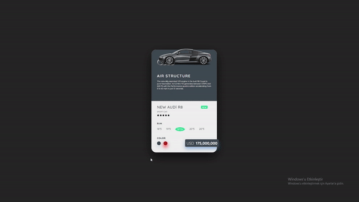

<h1> Audi Renk Geçiş Uygulaması </h1>

Bu basit web uygulaması, kullanıcıların renklere tıklayarak Audi arabaları arasında geçiş yapabilmelerini sağlayan interaktif bir renk geçiş uygulamasıdır. Proje, HTML, CSS ve JavaScript kullanılarak geliştirilmiştir.

<h1> Özellikler </h1>

- Renk geçişi: Kullanıcılar, renklere tıklayarak Audi arabaları arasında yumuşak bir renk geçişini deneyimleyebilirler.
- Görsel efektler: Renk geçişleri, kullanıcıya görsel olarak çekici bir deneyim sunar.
- Responsive tasarım: Farklı ekran boyutlarına uyumlu bir kullanıcı deneyimi sağlar.

<h2>Ekran Görüntüsü</h2>

